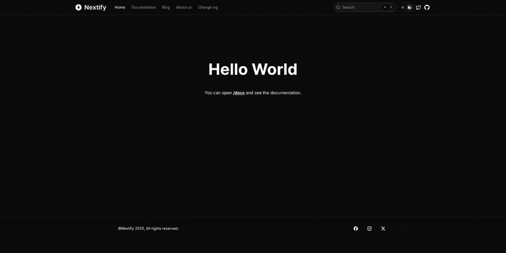
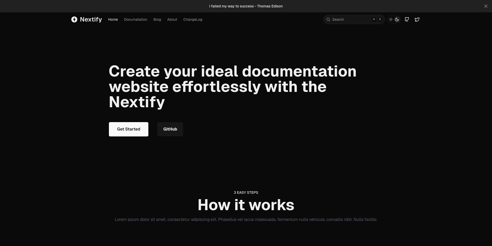
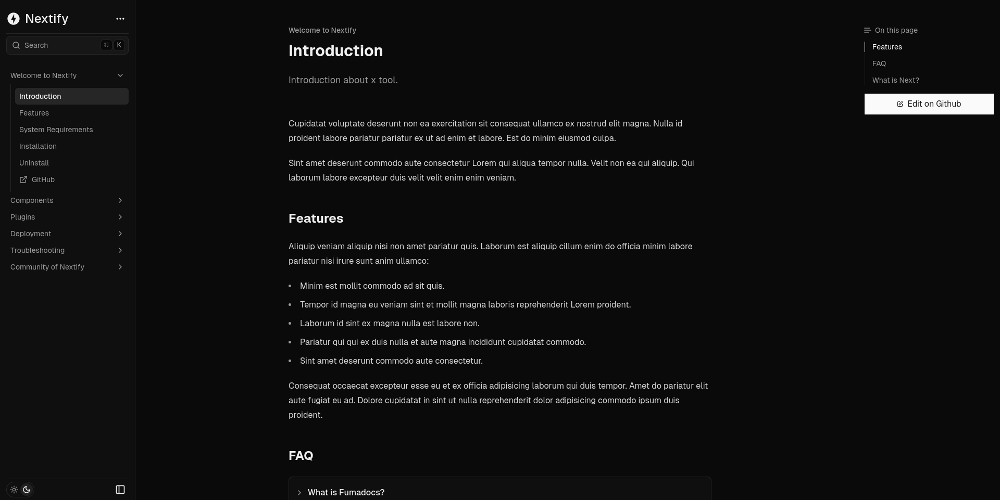
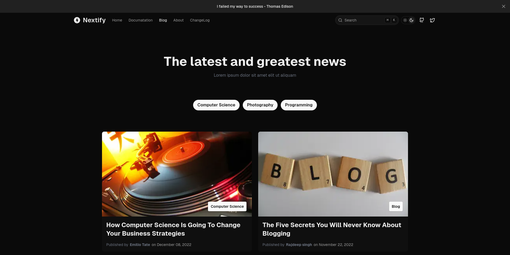
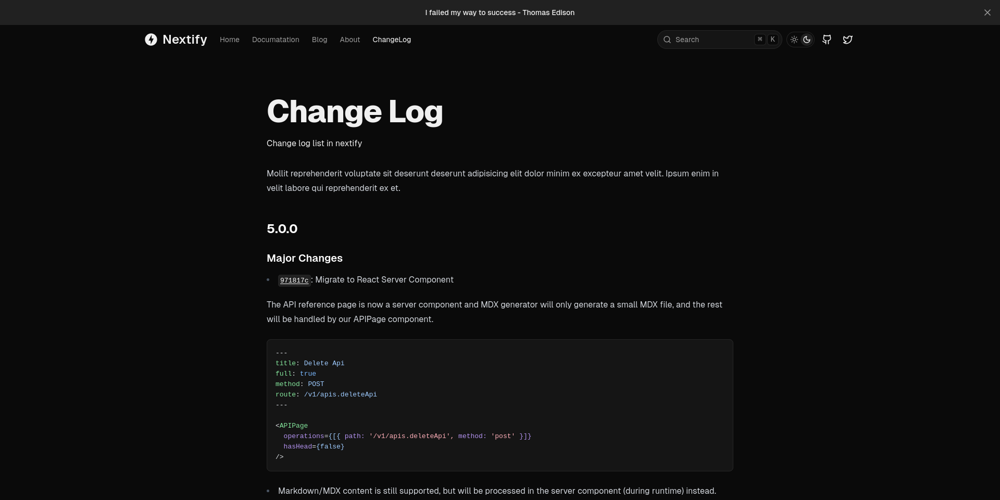
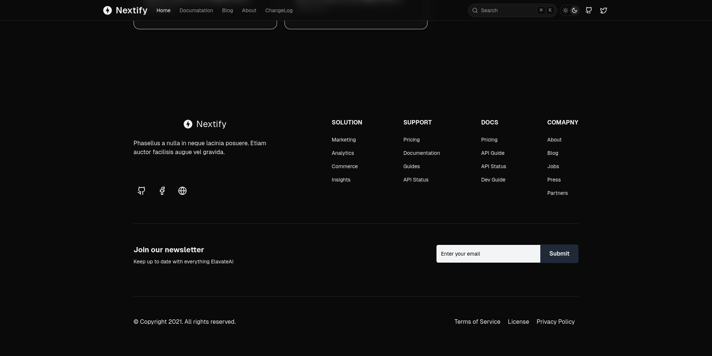
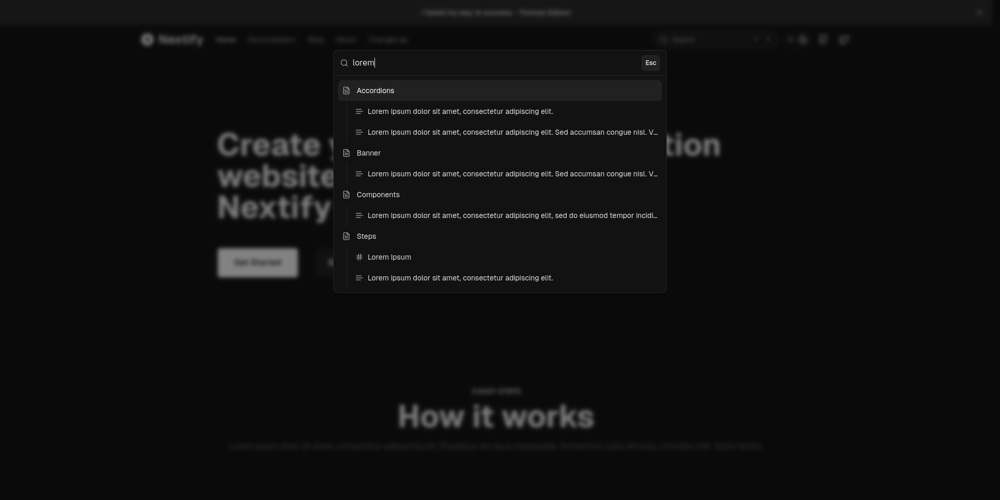

> In working stage

# Nextify Template

Nextify is a prebuilt template for building documentation sites using Next.js, Tailwind CSS, and Fumadocs.

## Demo



### Pictures













## Get Started

First step is to clone the Nextify template from github using git.

```bash
git clone https://github.com/frontendweb3/Nextify.git
```
Next install the package.

```bash
pnpm install
# or
npm install
```
Lastly run the development server:

```bash
npm run dev
# or
pnpm dev
# or
yarn dev
```

Open <http://localhost:3000> with your browser to see the result.

## Learn More

To learn more about Next.js and Fumadocs, take a look at the following
resources:

- [Next.js Documentation](https://nextjs.org/docs) - learn about Next.js
  features and API.
- [Learn Next.js](https://nextjs.org/learn) - an interactive Next.js tutorial.
- [Fumadocs](https://fumadocs.vercel.app) - learn about Fumadocs
