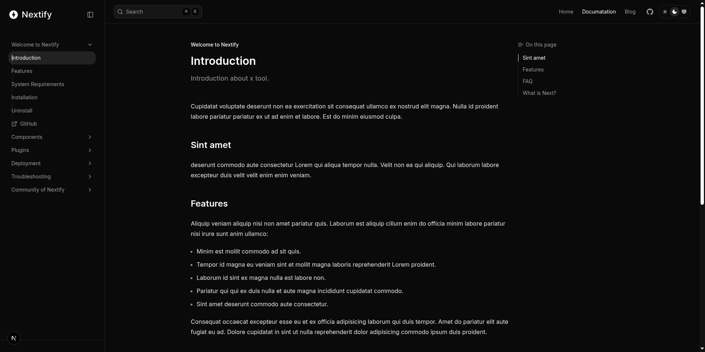
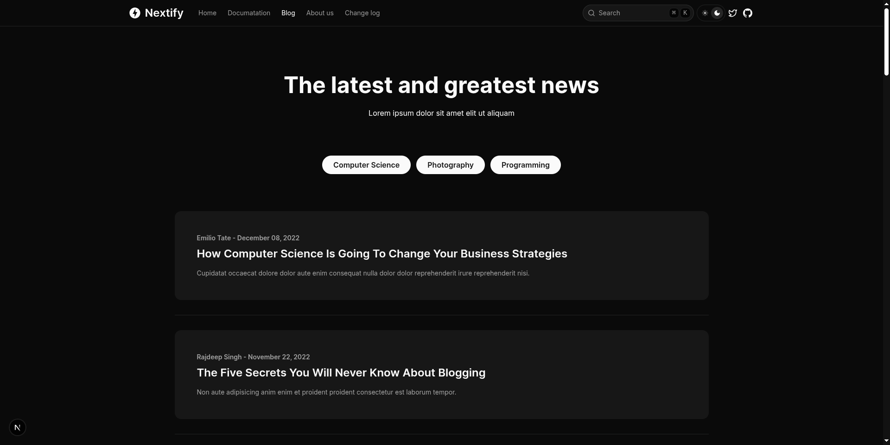
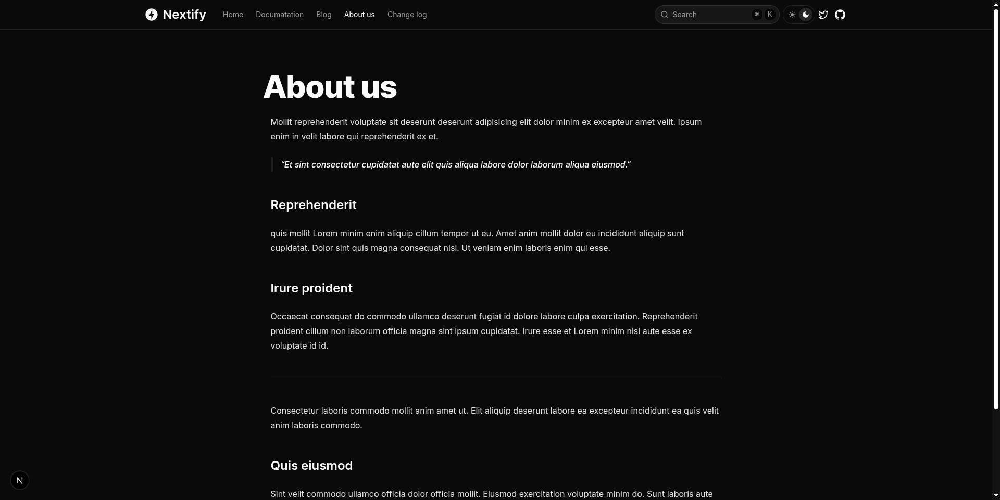
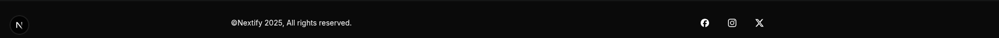
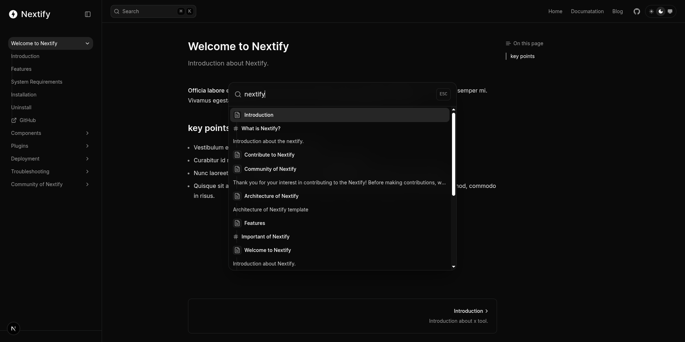

<p align="center">
    
    <h1 align="center">Nextify - Open sourec Template</h1>
</p>

<div style="display:flex; margin: 5px auto;">

  
  
  
  
  
  
  
  

</div>

<div style="margin-top: 10px auto;width:100%;"></div>

---

**Nextify template** is a prebuilt template for building documentation sites using [Next.js](https://nextjs.org), [Tailwind CSS](https://tailwindcss.com), and [Fumadocs](https://fumadocs.vercel.app/docs/ui/comparisons).

<div style="margin: 10px auto;width:100%;padding-bottom: .3em;font-size: 2em;border-bottom: 1px solid var(--borderColor-muted, var(--color-border-muted));"></div>

### Features:

Every feature in the nextify template comes from fumadocs itself.

- In-built dark and light mode
- Support the Blog, tag page and Page
- In-built Full-text Search functionality
- MDX support
- Syntax Highlighting
- Inbuilt components support
- Support the Next.js App Router and React server Component
- Tailwind CSS support
- I18n support
- Table of Contents
- Remote Source
- RTL Layout

## Demo


### Pictures















## Get Started

First step is to clone the Nextify template from github using git.

```bash
git clone https://github.com/frontendweb3/nextify.git

cd nextify
```

Next install the node package.

```bash
pnpm install
# or
npm install
```

Lastly run the development server:

```bash
npm run dev
# or
pnpm dev
# or
yarn dev
```

Open <http://localhost:3000> with your browser to see the result.

## MetaData/Frontmatter

Frontmatter for creating **`new documentation file`**.

```markdown
---
title: Architecture of Nextify
description: Architecture of Nextify template
---

Ut ullamco et aliqua `fugiat quis` Lorem aliquip in.
```

Frontmatter for creating **`new Blog post`**.

```markdown
---
title: 10 Things You Most Likely Didn't Know About Health.
description:
  Culpa laboris aliquip ea consectetur mollit ea ipsum sint qui culpa laboris
  dolor adipisicing proident. Et officia consequat do nulla tempor cupidatat
  elit.
date: 2022-11-12T08:05:53.939Z
draft: false
tags:
  - Health
  - Likely
  - Didn't Know
category:
  - Health
image: /images/vegetables.jpg
author: Curtis Lopez
---

Cupidatat voluptate deserunt non ea exercitation sit consequat ullamco ex nostrud elit magna.
```

Frontmatter for **`creating new page`**.

```markdown
---
title: About us
description: About the author
date: 2022-11-08T08:55:59.004Z
tags:
  - Blog
  - About
author: Rajdeep Singh
---

Cupidatat voluptate deserunt non ea exercitation sit consequat.
```

## Card

Nextify supports two types of blog cards.

### Card 1


You can enable it:

```typescript
// app/(home)/layout.config.tsx
import type { HomeLayout } from "@/types";
// shared configuration for site (home layout)
export const baseOptions: HomeLayout = {
  card_type: {
    home: "Card_1",
    tag: "Card_1",
  },
};
```

### Card 2


You can enable it:

```typescript
// app/(home)/layout.config.tsx
import type { HomeLayout } from "@/types";
// shared configuration for site (home layout)
export const baseOptions: HomeLayout = {
  card_type: {
    home: "Card_2",
    tag: "Card_2",
  },
};
```

## Learn More

To learn more about Next.js and Fumadocs, take a look at the following
resources:

- [Next.js Documentation](https://nextjs.org/docs) - learn about Next.js
  features and API.
- [Learn Next.js](https://nextjs.org/learn) - an interactive Next.js tutorial.
- [Fumadocs](https://fumadocs.vercel.app) - learn about Fumadocs
